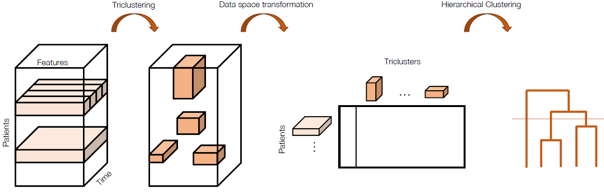

# ClusTric

Identifying disease progression patterns and groups of similar progressors is becoming more relevant to understanding disease progression and improving personalized treatments. As most works focus on univariate temporal analysis, they are incapable of detecting complex temporal patterns. In this study, we propose a novel approach, ClusTric, to learn comprehensive patterns from triclustering and feed these patterns to an agglomerative clustering algorithm to disclose patient groups. We apply the proposed method to Amyotrophic Lateral Sclerosis (ALS), a neurodegenerative disease with patients manifesting heterogeneous temporal progressions. Specifically, we analyzed the results using the Lisbon ALS clinic dataset containing patient follow-up data and unveiled four clinically relevant progression profiles, namely fast and slow progressors and moderate bulbar and spinal progressors. The results were validated in a publicly available ALS cohort, confirming the robustness of the proposed method. We compared ClusTric with a state-of-the-art method with relevant results in ALS. Our method showed to improve the groups' composition when compared to the state-of-the-art.



### Run Clustric:
```
python3 .\src\clustric.py <config_file>
```

#### Config File

```
DATA_FILE: <path_to_snapshots_file>
TOP_FOLDER: <output_folder_name>
N_CLUST: <number_of_clusters>  
MIN_APP: <minimal_number_of_appointments>             
REF_FEATURE: <feature_to_identify_each_patient>

TEMPORAL_FEATURES: <list_temporal_features>
```

### Relevant Citations
Full article can be found here: <insert article link>
